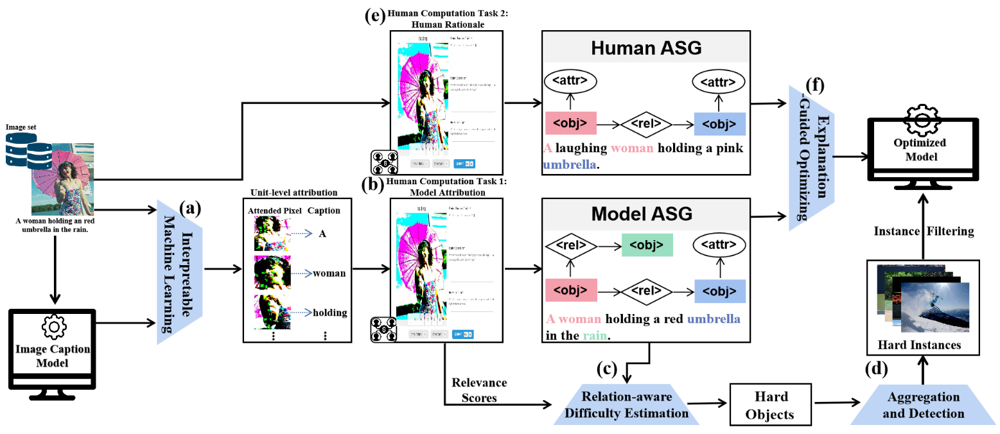

# RAAA: A Human-in-the-loop Framework to Interpret and Improve Image Caption with Relation-Aware Attribution Analysis

This repository contains PyTorch implementation of our paper [RAAA: A Human-in-the-loop Framework to Interpret and Improve Image Caption with Relation-Aware Attribution Analysis]().



## Prerequisites

```
# clone the repository
git clone git@github.com:anonymous330081/RAAA.git
cd ego2cap
export PYTHONPATH=$(pwd):${PYTHONPATH}
```

Create conda environment and install dependencies using `requirements.txt` file:

```
conda create -n ENV_NAME python>=3.6
conda activate ENV_NAME
pip install -r requirements.txt
```

## Training & Inference
```
cd exguidedimcap/train

# setup config files
# you should modify data paths in configs/prepare_coco_imgsg_config.py
python configs/prepare_coco_imgsg_config.py 
resdir='' # copy the output string of the previous step

# training
python ego2caption.py $resdir/model.json $resdir/path.json --eval_loss --is_train --num_workers 8

# inference(EGO)
python ego2caption.py $resdir/model.json $resdir/path.json --eval_set val_sub --num_workers 8

# inference(EGDD+EGO)
python ego2caption.py $resdir/model.json $resdir/path.json --eval_set val_sub_opt --num_workers 8
```

## Datasets

All datasets can be download from [GoogleDrive](https://drive.google.com/drive/folders/1IXjhFePGt9iWDBsPnBbLWRXXKRfeW__C?usp=sharing)

### Model ASG Annotations

Model ASG Annotations are annotated by crowed workers in the platform `ScaleAI`.
Annotation results(part) are in `tasks.json` file. (Note:Due to privacy concerns, we have only open-sourced partial annotation results.)
### Human ASG Annotations(sampled from MSCOCO)
#### Annotation

- Human ASG annotations: regionfiles directory

```
JSON Format:
{
	"region_id": {
		"objects":[
			{
	     		"object_id": int, 
	     		"name": str, 
	     		"attributes": [str],
				"x": int,
				"y": int, 
				"w": int, 
				"h": int
			}],
  	  "relationships": [
			{
				"relationship_id": int,
				"subject_id": int,
				"object_id": int,
				"name": str
			}],
  	  "phrase": str,
  }
}
```

- vocabularies
int2word.npy: [word]
word2int.json: {word: int}

- data splits: public_split directory
trn_names.npy, val_names.npy, val_sub_names.npy val_sub_opt_names.npy

#### Features
Global and Region Image Features for MSCOCO.

- Global Image Feature(MP directory): the last mean pooling feature of [ResNet101 pretrained on ImageNet](https://pytorch.org/vision/stable/models.html#table-of-all-available-classification-weights)

format: npy array, shape=(num_fts, dim_ft)
corresponding to the order in data_split names

- Region Image Feature(SA directroy): fc7 layer of [Faster-RCNN pretrained on VisualGenome](https://github.com/cshizhe/maskrcnn_benchmark)

format: hdf5 files, "image_id".jpg.hdf5

  key: 'image_id'.jpg
  
  attrs: {"image_w": int, "image_h": int, "boxes": 4d array (x1, y1, x2, y2)}


